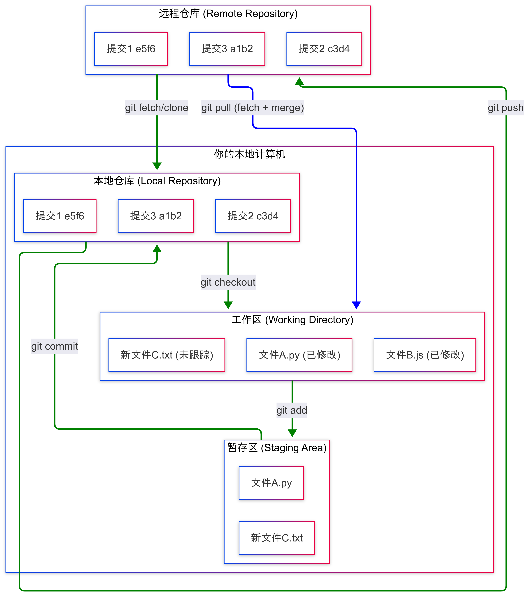
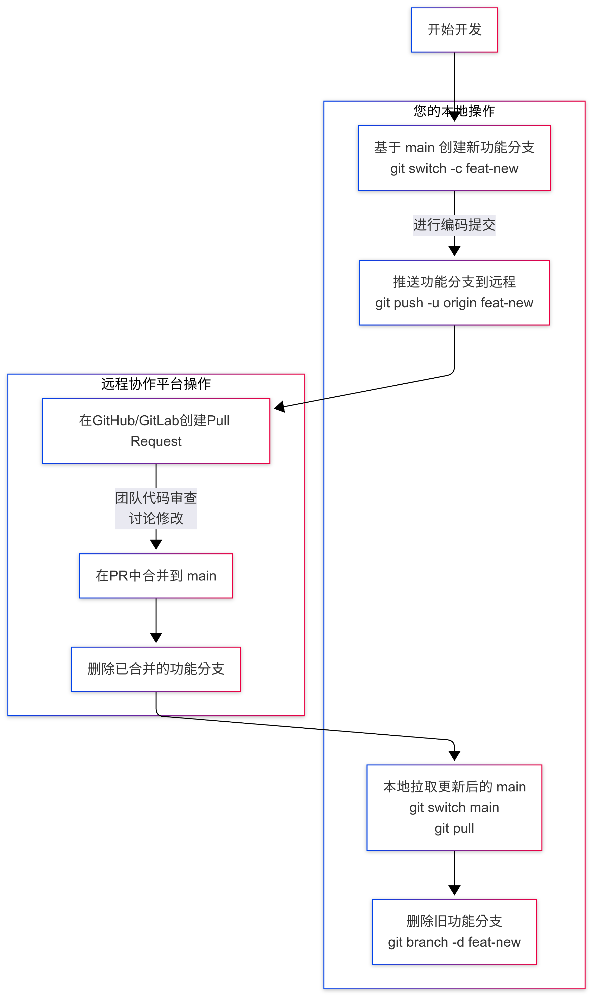

---

# 🖥️ Git 命令行常用快捷键速查表

---

---

### 一、 仓库创建与克隆

| 命令 | 说明 | 示例 |
| :--- | :--- | :--- |
| `git init` | 在当前目录初始化一个新的 Git 仓库 | `git init` |
| `git clone <url>` | 克隆一个远程仓库到本地 | `git clone https://github.com/user/repo.git` |

---

### 二、 基础快照操作（提交工作流）

这是最核心、最常用的一组命令。

| 命令 | 说明 | 示例 |
| :--- | :--- | :--- |
| `git status` | 查看工作区和暂存区的状态（**常用**） | `git status` |
| `git add <file>` | 将**指定文件**添加到暂存区 | `git add index.html` |
| `git add .` | 将**所有修改和新增文件**添加到暂存区 | `git add .` |
| `git add -A` | 添加所有变化（包括删除的文件）到暂存区 | `git add -A` |
| `git commit -m "msg"` | 提交暂存区的更改，并附上提交信息 | `git commit -m "Fix login bug"` |
| `git commit -am "msg"` | 一次性添加**已跟踪文件**的修改并提交（**注意：不会添加新文件**） | `git commit -am "Update docs"` |
| `git restore <file>` | **丢弃工作区**中指定文件的修改（Git 2.23+） | `git restore style.css` |
| `git restore --staged <file>` | 将文件从**暂存区撤出**，但保留工作区的修改（Git 2.23+） | `git restore --staged main.py` |
| `git rm <file>` | 从工作区和暂存区**删除文件** | `git rm old_file.txt` |
| `git mv <old> <new>` | **移动或重命名**文件，并通知 Git | `git mv old.txt new.txt` |

---

### 三、 分支管理

| 命令 | 说明 | 示例 |
| :--- | :--- | :--- |
| `git branch` | 列出所有本地分支 | `git branch` |
| `git branch -a` | 列出所有本地和远程分支 | `git branch -a` |
| `git branch <name>` | 创建一个新分支 | `git branch feature-auth` |
| `git switch <branch>` | **切换到**指定分支（Git 2.23+） | `git switch main` |
| `git switch -c <branch>` | **创建并切换到**新分支（Git 2.23+） | `git switch -c hotfix` |
| `git checkout <branch>` | (旧命令) 切换到指定分支 | `git checkout main` |
| `git checkout -b <branch>` | (旧命令) 创建并切换到新分支 | `git checkout -b hotfix` |
| `git merge <branch>` | 将指定分支**合并到当前分支** | `git switch main`   `git merge feature-auth` |
| `git branch -d <branch>` | **删除**一个已合并的分支 | `git branch -d old-feature` |
| `git branch -D <branch>` | **强制删除**一个分支（即使它未合并） | `git branch -D broken-feature` |

---

### 四、 远程协作

| 命令 | 说明 | 示例 |
| :--- | :--- | :--- |
| `git remote -v` | 查看远程仓库地址（**常用**） | `git remote -v` |
| `git fetch` | 从远程仓库**获取**最新信息，但不自动合并 | `git fetch origin` |
| `git pull` | 从远程仓库获取并**自动合并**到当前分支（=`git fetch` + `git merge`） | `git pull origin main` |
| `git push` | 将本地提交**推送**到远程仓库 | `git push origin main` |
| `git push -u origin <branch>` | 推送并建立本地分支与远程分支的**跟踪关系**（首次推送时用） | `git push -u origin feature` |
| `git push --force-with-lease` | **安全强制推送**（比 `--force` 更安全） | `git push --force-with-lease` |
| `git remote show origin` | 显示远程仓库 `origin` 的详细信息 | `git remote show origin` |

---

### 五、 查看历史与比较

| 命令 | 说明 | 示例 |
| :--- | :--- | :--- |
| `git log` | 查看提交历史 | `git log` |
| `git log --oneline` | 以简洁的单行模式查看历史 | `git log --oneline` |
| `git log --graph` | 以ASCII图形显示分支合并历史 | `git log --oneline --graph` |
| `git diff` | 查看**工作区**和**暂存区**的差异 | `git diff` |
| `git diff --staged` | 查看**暂存区**和**最后一次提交**的差异 | `git diff --staged` |
| `git blame <file>` | 逐行显示谁在什么时候修改了文件 | `git blame README.md` |

---

### 六、 撤销与回退

| 命令 | 说明 | 场景 |
| :--- | :--- | :--- |
| `git restore <file>` | 丢弃**工作区**的修改（见第二节） | 改乱了文件，想还原 |
| `git restore --staged <file>` | 取消**暂存**（见第二节） | `git add` 了不该add的文件 |
| `git reset --soft <commit>` | 回退到某个提交，**保留**更改作为**未提交的修改** | 想重新编辑上一次提交 |
| `git reset --mixed <commit>` | (默认) 回退到某个提交，**保留**更改作为**未暂存的修改** | 想取消提交和暂存，重新检查 |
| `git reset --hard <commit>` | **彻底回退**到某个提交，丢弃所有更改（**慎用！**） | 想彻底放弃最近几次提交 |
| `git revert <commit>` | 创建一个**新的提交**来撤销指定提交的更改（**最安全**） | 撤销一个已推送的提交 |

---

### 七、 临时存储

| 命令 | 说明 | 场景 |
| :--- | :--- | :--- |
| `git stash` | 将当前工作区和暂存区的修改**临时储藏**起来 | 需要紧急切换分支，但当前代码没写完 |
| `git stash list` | 列出所有储藏 | `git stash list` |
| `git stash pop` | 应用**最近一次**储藏并**删除**它 | 切换回来後恢复工作现场 |
| `git stash apply` | 应用某次储藏，但**不删除**它 | `git stash apply stash@{0}` |
| `git stash drop` | 删除某次储藏 | `git stash drop stash@{0}` |

---

### 总结记忆图

一个典型的日常工作流：
1.  **状态检查**：`git status` （我改了啥？）
2.  **添加文件**：`git add .` （我要提交哪些？）
3.  **提交**：`git commit -m "msg"` （打个包）
4.  **拉取更新**：`git pull` （同步远程最新代码，解决冲突）
5.  **推送**：`git push` （上传我的代码）

---

### Git PR示意图

---
